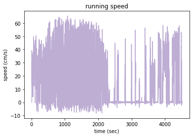
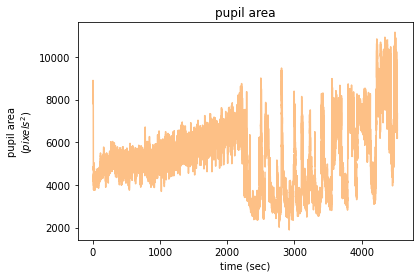
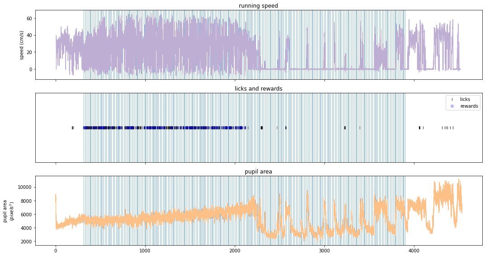
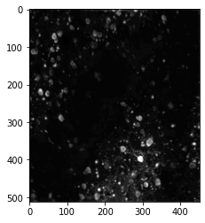
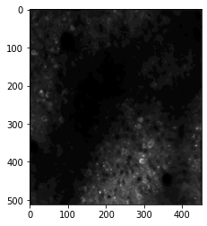
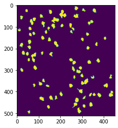

# visual_behavior_plotting package


## Background Information: 
The [Allen Institute Visual Behavior project](https://portal.brain-map.org/explore/circuits/visual-behavior-2p) used in vivo 2-photon calcium imaging (also called optical physiology, or “ophys”) to measure the activity of populations of genetically identified neurons in the visual cortex of mice performing a visually guided behavioral task (image change detection). The institute used single and multi-plane imaging approaches to record the activity of populations neurons across multiple cortical depths and two areas in the visual cortex. Each population of neurons was imaged repeatedly over multiple days under different sensory and behavioral contexts, including with familiar and novel stimuli, as well as active behavior and passive viewing conditions. This dataset can be used to evaluate the influence of experience, expectation, and task engagement on neural coding and dynamics.

## Plotting Package
The visual_behavior_plotting package offers utilities for quickly and easily manipulating and visualizing data from the Allen Institute Visual Behavior project. The end goal is to make data exploration easier and more approachable to those new to the visual behavior project datasets or new to python. 

 
# Dependencies:
Functions in this repository depend on the [AllenSDK](https://github.com/AllenInstitute/AllenSDK), as well as other packages noted in the steup.py file


# Installation (developer mode)

clone the repo
```
git clone https://github.com/DowntonCrabby/visual_behavior_plotting.git
```

Set up a dedicated conda environment for visual behavior plotting :

```
conda create -n vb_plot python=3.8 
```

Activate the new environment:

```
conda activate vb_plot
```

Make the new environment visible in Jupyter 
```
pip install ipykernel
python -m ipykernel install --user --name vb_plot
```

Install visual_behavior_plotting in the virtual environment for use in jupyter notebooks etc. 
```
cd visual_behavior_plotting
pip install -e .
```

# Examples and Use Case:
A more in depth jupyter notebook tutorial of how to load Allen SDK data and plot it using visual_behavior_plotting can be found here: [Visual Behavior Plotting Tutorial](examples/visual_behavior_plotting_tutorial.ipynb).

Here is a brief overview of some of the plotting functionality: 

load a visual behavior dataset via the allen SDK:
```
ophys_experiment_id = 1051216600
ophys_dataset = cache.get_behavior_ophys_experiment(ophys_experiment_id)
```

plot various mouse behavior attributes:

```
behav_plt.plot_behavioral_streams(ophys_dataset)
```



```
behav_plt.plot_behavioral_streams(ophys_dataset)
```


```
behav_plt.plot_behavioral_streams(ophys_dataset)
```



plot various neural response attributes:
```
neural_plt.plot_max_projection(ophys_dataset)
```


```
neural_plt.plot_average_projection(ophys_dataset)
```


```
neural_plt.plot_segmentation_masks(ophys_dataset)
```


